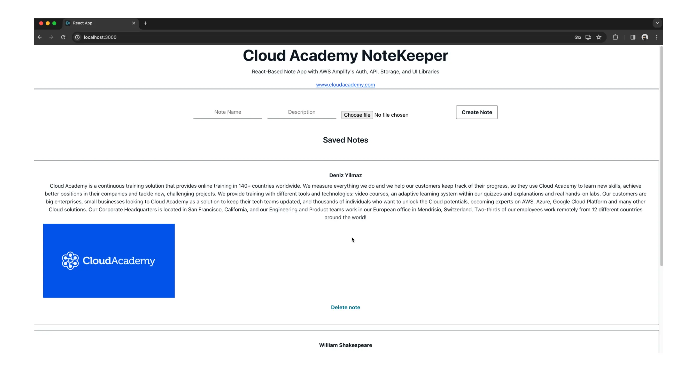
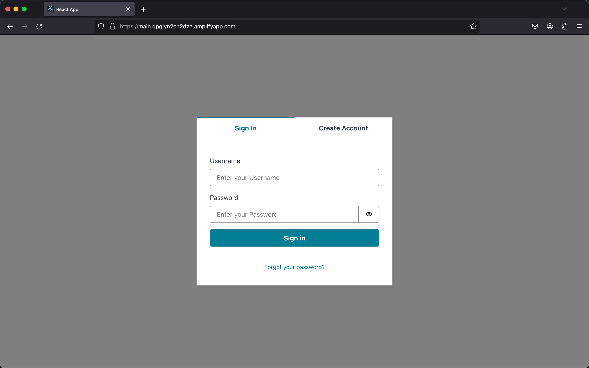

<h1 align="center">Create Web Applications Using AWS Amplify</h1>

<p align="center">
  <a href="https://cloudacademy.com/course/high-performance-text-analysis-huggingface-gpt-2-aws-neuron-aws-inferentia-5935/introduction-28032024101057/">
    
  </a>
</p>


This repository accompanies our detailed lesson on Cloud Academy, where we guide you through the process of building and deploying a full-stack React application using AWS Amplify. Here, you'll find the essential code and brief instructions needed to set up and run the NoteKeeper app. This repository is designed to provide you with a quick start guide to deploying the NoteKeeper app. It includes the necessary JavaScript code and configuration files for integrating AWS services like Cognito for authentication, DynamoDB for data storage, and S3 for file storage. For a step-by-step guide on how to leverage these resources and detailed explanations of each step, please watch the full lesson on Cloud Academy.

## **Setting Up the AWS Amplify CLI and Initializing a React App**

### Installing the Amplify CLI
1. Ensure you have Node.js and npm installed:
   ```
   node -v
   npm -v
   ```
2. Install the Amplify CLI:
   ```
   npm install -g @aws-amplify/cli
   ```

### Configuring the Amplify CLI
1. Run the `amplify configure` command and follow the on-screen prompts to configure your AWS credentials.
2. Select your preferred AWS Region.
3. Create a new IAM user with administrative access for Amplify.
4. Generate and input the Access Key and Secret Access Key.
5. Choose to use the default profile.

### Creating a React Application
1. Create a new React application:
   ```
   npx create-react-app notes-app
   ```
2. Change into the project directory:
   ```
   cd notes-app
   ```
3. Preview the React application:
   ```
   npm start
   ```

### Initializing Amplify
1. In the project directory, run the `amplify init` command and follow the on-screen prompts.
2. Select the environment name, editor, and other configuration options.
3. Choose the "AWS profile" authentication method and use the default profile.

## **Building the Backend for a React Notes App With the Amplify CLI**

### Adding Authentication
1. Add authentication to your application:
   ```
   amplify add auth
   ```
   - Select the authentication method (e.g., username)
   - Configure user attributes as needed
2. Deploy the authentication resources:
   ```
   amplify push
   ```
3. View the authentication service in the Amplify Console:
   ```
   amplify console auth
   ```

### Adding APIs and Storage
1. Add a GraphQL API:
   ```
   amplify add api
   ```
   - Select `GraphQL`
   - Choose the `Single object with fields` option
   - Edit the GraphQL schema as follows:

   ```
   type Note @model @auth(rules: [ { allow: public } ] ){
   id: ID!
   name: String!
   description: String
   image: String
   }
   ```

2. Deploy the API changes:
   ```
   amplify push
   ```
   - Generate code for the GraphQL API

3. Add cloud storage (Amazon S3):
   ```
   amplify add storage
   ```
   - Choose the `content` option
   - Configure the storage settings (e.g., access permissions)

### Checking Resource Status
1. Check the status of your local cloud resources:
   ```
   amplify status
   ```
2. Synchronize local changes to the cloud:
   ```
   amplify push
   ```

## **Integrating Authentication in a React App Using Amplify UI Components**

### Install Amplify Libraries
1. Install the required Amplify libraries:
   ```
   npm install aws-amplify @aws-amplify/ui-react
   ```

### Configure Amplify in the Project
1. In the `index.js` file, import and configure Amplify with the `aws-exports.js` file:

   ```javascript
   import Amplify from 'aws-amplify';
   import config from './aws-exports';
   Amplify.configure(config);
   ```

### Modify the App Component
1. In the `App.js` file, import the necessary Amplify UI components:

   ```javascript
   import "@aws-amplify/ui-react/styles.css";
   import { withAuthenticator, Button } from '@aws-amplify/ui-react';
   ```

2. Modify the `App` function to accept the `signOut` prop:

   ```javascript
   function App({ signOut }) {
     // Your app code
   }
   ```

3. Add a sign-out button using the Amplify UI `Button` component:

   ```javascript
   <Button onClick={signOut} variation="primary">Sign Out</Button>
   ```

4. Wrap the `App` component with the `withAuthenticator` higher-order component:

   ```javascript
   export default withAuthenticator(App);
   ```

5. Save the changes and start the application:

   ```
   npm start
   ```

6. The application will now have a sign-in/sign-up flow managed by AWS Amplify, and a sign-out button in the `App` component.



## **Integrating Amplify Libraries and UI Components To Build a React Notes App**

### Setting up the App.js
1. Copy the provided `App.js` code and replace the contents of your project's `App.js` file.

   ```javascript
      // Import React, Amplify UI components, GraphQL operations, and Amplify storage functions
   import React, { useState, useEffect } from "react";
   import "./App.css";
   import "@aws-amplify/ui-react/styles.css";
   import {
   Button,
   Flex,
   Heading,
   Text,
   TextField,
   Image,
   View,
   withAuthenticator,
   Link,
   Card,
   Divider,
   } from "@aws-amplify/ui-react";
   import { listNotes } from "./graphql/queries";
   import { createNote as createNoteMutation, deleteNote as deleteNoteMutation } from "./graphql/mutations";
   import { generateClient } from 'aws-amplify/api';
   import { uploadData, getUrl, remove } from 'aws-amplify/storage';

   // Generate an Amplify API client
   const client = generateClient();

   const App = ({ signOut }) => {
   // State hook for storing notes
   const [notes, setNotes] = useState([]);

   // Fetch notes from the API on component mount
   useEffect(() => {
      fetchNotes();
   }, []);

   // Function to fetch notes, including resolving image URLs
   async function fetchNotes() {
      const apiData = await client.graphql({ query: listNotes });
      const notesFromAPI = apiData.data.listNotes.items;
      await Promise.all(notesFromAPI.map(async (note) => {
         if (note.image) {
         const url = await getUrl({ key: note.name });
         note.image = url.url;
         }
         return note;
      }));
      setNotes(notesFromAPI);
   }

   // Function to handle note creation, including image upload
   async function createNote(event) {
         event.preventDefault();
         const form = new FormData(event.target);
         const image = form.get("image");
         const data = {
            name: form.get("name"),
            description: form.get("description"),
            image: image ? image.name : null,
         };
         if (data.image) {
            await uploadData({ key: data.name, data: image });
         }
         await client.graphql({ query: createNoteMutation, variables: { input: data } });
         fetchNotes();
         event.target.reset();
   }

   // Function to handle note deletion, including removing the associated image
   async function deleteNote({ id, name }) {
      const newNotes = notes.filter(note => note.id !== id);
      setNotes(newNotes);
      if (name) await remove({ key: name });
      await client.graphql({ query: deleteNoteMutation, variables: { input: { id } } });
   }

   // Render the application UI
   return (
      <View className="App">
         {/* App heading */}
         <Heading level={1} fontWeight="bold">Cloud Academy NoteKeeper</Heading>
         <Text fontWeight="normal" color="secondary" style={{ marginTop: '0.5rem', marginBottom: '1rem' }}>
         React-Based Note App with AWS Amplify's Auth, API, Storage, and UI Libraries</Text>

         {/* External link example */}
         <Link href="www.cloudacademy.com" color="#035DEB" textDecoration="underline dotted" isExternal>
         www.cloudacademy.com
         </Link>

         {/* Divider example */}
         <Flex direction="column">
            <Divider size="large" orientation="horizontal" />
         </Flex>

         {/* Note creation form */}
         <View as="form" margin="3rem 0" onSubmit={createNote}>
         <Flex direction="row" justifyContent="center">
            <TextField name="name" placeholder="Note Name" label="Note Name" labelHidden variation="quiet" required />
            <TextField name="description" placeholder="Description" label="Note Description" labelHidden variation="quiet" required />
            <View name="image" as="input" type="file" style={{ alignSelf: "end" }} />
            <Button colorTheme="overlay" type="submit"> Create Note</Button>
         </Flex>
         </View>

         {/* Display saved notes */}
         <Heading level={4}>Saved Notes</Heading>
         <View margin="3rem 0">
         {notes.map(note => (
            <Card key={note.id} variation="outlined" style={{ marginBottom: '1rem' }}>
               <Flex direction="column" gap="0.5rem" padding="1rem">
               <Text fontWeight="bold">{note.name}</Text>
               <Text>{note.description}</Text>
               {note.image && (
                  <Image src={note.image} alt={`visual aid for ${notes.name}`} style={{ width: 400 }}/>
               )}
               <Button variation="link" onClick={() => deleteNote(note)}>Delete note</Button>
               </Flex>
            </Card>
         ))}
         </View>

         {/* Sign-out button */}
         <Button colorTheme="overlay" variation="primary" onClick={signOut}>Sign Out</Button>
      </View>
   );
   };

   // Wrap App component with Amplify authenticator
   export default withAuthenticator(App);
   ```

2. The code includes the following:
   - Importing React and necessary Amplify UI components
   - Functions for managing notes (listing, creating, deleting)
   - Functions for managing image uploads, URLs, and deletions
   - The main App component that renders the notes app UI

### Updating the GraphQL Schema
1. Open the `schema.graphql` file in the `amplify/backend/api` directory.
2. Update the `Note` type to include an `image` field of type `String`:

   ```graphql
   type Note @model @auth(rules: [ { allow: public } ]) {
     id: ID!
     name: String!
     description: String
     image: String
   }
   ```

3. Save the changes and run `amplify push` to update the GraphQL API.
   - Confirm the API update and generate new GraphQL statements.

### Running the Application
1. In the project's root directory, run `npm start` to start the application.
2. The notes app should now load with the updated functionality, including the ability to:
   - Create new notes with optional image uploads
   - List existing notes
   - Delete notes and their associated images

### Exploring the Backend Resources
1. Run `amplify console storage` to open the S3 bucket that stores the note images.
2. Navigate to the Amplify console for your notes app and select the API section.
3. View the DynamoDB table created for the `Note` type, which stores the note details and image references.

The application now integrates with various AWS services, including Amazon Cognito for authentication, Amazon DynamoDB for note storage, and Amazon S3 for image storage, all managed and configured through the Amplify CLI and Amplify UI components.

## **Hosting Your React App With AWS Amplify Hosting**

### Continuous Deployment with GitHub
1. Ensure your React application is initialized with Git:
   - Check the status with `git status`
   - If not initialized, run `git init`
2. Create a new GitHub repository for your project.
3. Commit your initial changes and push to the GitHub repository:
   ```
   git add .
   git commit -m "Deploy Notes App to Amplify"
   git remote add origin git@github.com:username/reponame.git
   git branch -M main
   git push -u origin main
   ```

### Amplify Hosting Setup
1. In your terminal, run `amplify add hosting` to initiate the hosting setup.
2. Choose the `Hosting with Amplify Console` option for continuous deployment.
3. Select `Continuous deployment` to enable automatic build and deployment.
4. Connect your GitHub repository in the Amplify Console.
5. Configure the build settings and create a new service role.
6. Review the settings and deploy your configuration.
7. Once the deployment is finished, access your hosted application via the provided domain link.

### Adding a Custom Domain
1. In the Amplify Console, go to `Domain management` and click `Add domain`.
2. Choose the domain you want to use and proceed with the configuration.
3. Configure any subdomains and SSL certificate settings as needed.
4. Save the changes, and Amplify will handle the domain verification and propagation.
5. Your web application will now be accessible via your custom domain.

### Deleting the Project
1. In your terminal, run `amplify delete` to remove all selected services and associated resources.
2. Review the changes to ensure all desired resources have been removed successfully.

The AWS Amplify Hosting service simplifies the hosting and deployment of your React application, providing a seamless continuous deployment workflow integrated with your Git repository.